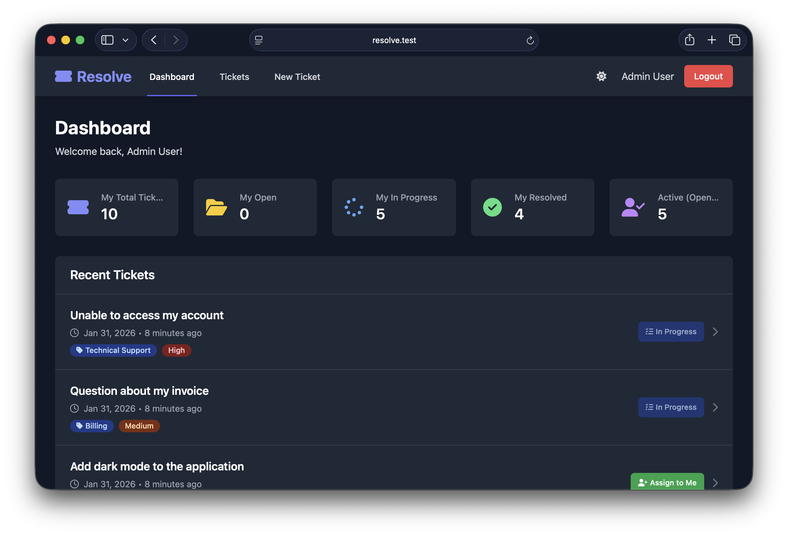

# Resolve - Help Desk Support System

Resolve is a help desk support system built with Laravel 11. It includes a full web UI and an API for managing tickets, categories, and agent collaboration.



## Key Features

-   **Web UI and API:** Web experience for agents and users plus a REST API for integrations.
-   **Ticket Management:** Full CRUD for support tickets with status and priority.
-   **Ticket Assignment:** Agents can assign tickets to themselves and see assignment status in the UI.
-   **Agent Workflow:** Agents can create tickets on behalf of users.
-   **Filters and Tabs:** Status tabs, category filter, and an Assigned to Me filter.
-   **Comments and Internal Notes:** Comments support internal notes visible only to agents.
-   **Dark Mode:** Theme toggle with persistence for web pages including auth, dashboard, and tickets.
-   **Responsive UI:** Mobile navigation and responsive filters for small screens.
-   **Security First:** Policy-based authorization ensures users only access their own data.
-   **Performance Optimized:** Uses eager loading to avoid N+1 queries and API Resources for clean JSON.

---

## Technical Stack

-   **Framework:** Laravel 11
-   **Authentication:** Laravel Sanctum
-   **Database:** SQLite (default for portability)
-   **Testing:** Pest PHP (feature and unit testing)
-   **Architecture:** RESTful API with JSON Resources

---

## Setup

1. Install dependencies

```bash
composer install
```

2. Create environment file

```bash
cp .env.example .env
php artisan key:generate
```

3. Run migrations and seed demo data

```bash
php artisan migrate --seed
```

4. Start the app

```bash
php artisan serve
```

The app will be available at http://127.0.0.1:8000.

## Demo Logins

Use these accounts after running the database seeder:

-   **Admin/Agent:** admin@resolve.test
-   **User:** demo@resolve.test

All demo accounts use the password: password

---

## API Endpoints

### Authentication (Breeze)
- `POST /register` - Create a new account
- `POST /login` - Receive an authentication token

### Tickets
- `GET /api/tickets` - List authenticated user's tickets (Paginated)
- `POST /api/tickets` - Create a new support request
- `GET /api/tickets/{id}` - View specific ticket details (Policy protected)
- `PATCH /api/tickets/{id}` - Update ticket title or description

### Comments
- `POST /api/tickets/{id}/comments` - Add a comment to a ticket

---

## Testing

This project follows a Test-Driven Development (TDD) approach. The test suite covers authentication, resource authorization, and role-based access control.

To run the tests:
```bash
php artisan test
